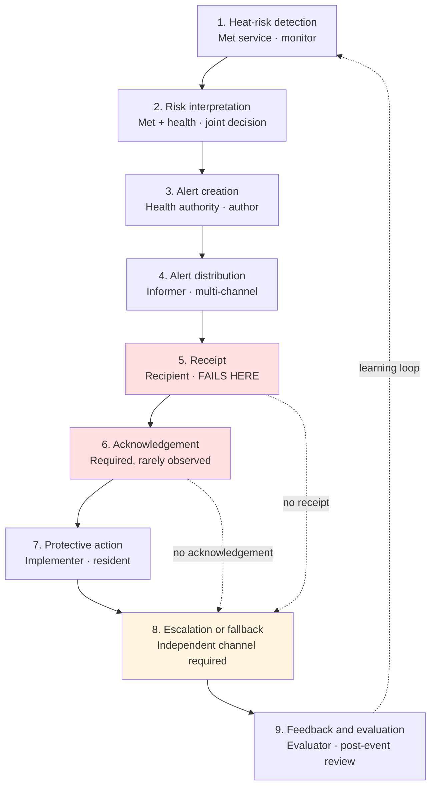

# Chris Stakeholder Journey and Contact-Point Map

**Project:** HeatShield — Heat Risk Dashboard Roadmap Initiative
**Research stream:** Stakeholders, Communication Logistics, Adoption, and CSAT-Style Evaluation
**Date:** 20 August 2026

---

## Purpose and boundary

This document maps how heat-risk information moves from detection to feedback **at contact-point level only**. It identifies who holds each step, what information passes, where the handoff occurs and what can fail. It does **not** design clinical, hospital, emergency or community-health workflows — those remain out of scope for this course phase.

**Reading the evidence column.** Every stage cites the canonical source IDs from `Chris_source_inventory.md`. Where a stage rests on transferred rather than heat-specific evidence, that is stated in the stage text. Where no evidence exists, the row says so rather than filling the gap with a plausible-sounding design.

**Role vocabulary.** Stage ownership uses the seven empirically derived heat-governance roles from Vanderplanken et al. (CS-04): **author, activator, coordinator, monitor, informer, implementer, evaluator**. Using published role labels rather than invented ones keeps the journey traceable.

---

## The journey at a glance

**The two red stages are where the published evidence says systems actually break.** Receipt fails silently (CS-18: front-line nurses unaware of the plan; CS-23: 9% miss even a national test; CS-54: only 7.9% of an opt-in subscriber base was 65+). Acknowledgement is a formal requirement (CS-14) that no operating heat system located in this review was documented as performing (CS-18).

---

## Stage 1 — Heat-risk detection

| Field | Content |
|---|---|
| **Main stakeholder** | National meteorological service (in Thailand, **TMD**) — role: *monitor* |
| **Supporting stakeholders** | Environmental research agencies; global forecast providers; academic partners |
| **Information required** | Temperature, humidity, forecast horizon, station or grid geography, observation timestamp and provenance |
| **Contact point** | Machine-to-machine: forecast/observation feed → HeatShield ingestion layer |
| **Primary channel** | Data feed (API, file or published bulletin) |
| **Expected action** | Compute or ingest the heat index; timestamp and attribute it |
| **Owner of the next step** | Health authority (joint threshold interpretation) |
| **Failure risk** | Feed outage, latency or silent staleness; spatial gaps between stations; **computing a non-official index** that diverges from the national product |
| **Evidence** | CS-01 (met service owns the climate component, p. vii); CS-96 (official Thai heat index is an inter-agency product); CS-115 (TMD produces daily and weekly heat index forecasts) |

**Design note.** HeatShield should consume the official Thai heat index rather than derive its own. The dashboard's contribution is interpretation and coordination, not meteorology — consistent with the project boundary.

---

## Stage 2 — Risk interpretation or decision

| Field | Content |
|---|---|
| **Main stakeholder** | Health authority jointly with the meteorological service — role: *activator* |
| **Supporting stakeholders** | Disease control and environmental health agencies; local government |
| **Information required** | Heat index value against a **published threshold band**; vulnerable-population context; the identity of who may authorise activation |
| **Contact point** | The threshold-crossing decision itself; standing inter-agency working group |
| **Primary channel** | Pre-agreed decision rule plus inter-agency contact (meeting, call, standing group) |
| **Expected action** | Confirm or override the band; decide whether to activate |
| **Owner of the next step** | Named alert author in the health authority |
| **Failure risk** | **Thresholds misaligned with where harm actually begins**; discretionary "wait and see" delay; ambiguity over who may authorise activation; **unresolved band definition** |
| **Evidence** | CS-01 (threshold-setting is a joint met–health decision; thresholds are response-specific, p. xii); CS-03 (an explicit alert decision pathway — who receives, who authorises, how escalation and stand-down are decided — should be specified in advance); CS-18 (planners applied discretionary judgment before escalating); CS-52 (England's thresholds described as misaligned with the ~25 °C point at which excess deaths begin); CS-96 vs CS-106 (**the Thai band structure is contested — five bands with a 54 °C top versus four bands with a 52 °C top**) |

**Open decision requiring human confirmation.** HeatShield must adopt one Thai band definition and name its source. The team cannot resolve this from the literature; it requires confirmation from a Thai authority.

---

## Stage 3 — Alert creation

| Field | Content |
|---|---|
| **Main stakeholder** | Health authority communications function — role: *author* |
| **Supporting stakeholders** | Meteorological service (joint sign-off); translation and accessibility reviewers; community organisation partners |
| **Information required** | Alert level and its **plain-language equivalent**; affected area; validity period; **one to three specific protective actions**; the issuing authority's identity; pre-translated language variants |
| **Contact point** | Message drafting and authorisation; the pre-season message bank |
| **Primary channel** | Internal authoring; a prepared template library |
| **Expected action** | Select and populate a pre-approved template; obtain sign-off |
| **Owner of the next step** | Informer / distribution function |
| **Failure risk** | Undifferentiated message sent to every recipient type; **live translation too slow** (5–10 minutes for certified interpreters) or machine-translated and corrupted; colour tier with no text equivalent; action recommended that the recipient cannot perform |
| **Evidence** | CS-01 (messages should be bespoke to recipient type; "clear, unambiguous language"); CS-19 (joint two-organisation issuance in England); CS-34 (83.9% of translating agencies use machine translation; interpreters take 5–10 minutes; **pre-translated templates are the evidence-supported fix**); CS-38 (colour-conveyed information needs a text equivalent); CS-13 (message content collapses in recall to three themes; only 5% mentioned drinking water unprompted); CS-30 (action conversion depends on whether the recommended action is feasible) |

---

## Stage 4 — Alert distribution

| Field | Content |
|---|---|
| **Main stakeholder** | Alert distribution function — role: *informer* |
| **Supporting stakeholders** | Media; local government; community health volunteers; employers; schools; care facilities; mobile network operators |
| **Information required** | The finalised message; the recipient list or broadcast area; the declared fallback channel |
| **Contact point** | Multiple simultaneous contact points — see `Chris_contact_point_matrix.md` |
| **Primary channel** | Multi-channel by requirement, not by preference |
| **Expected action** | Deliver the same alert level through every channel without divergence |
| **Owner of the next step** | Each named recipient; and, for onward cascade, a **named** local owner |
| **Failure risk** | **Channel inconsistency** between routes; delegated cascade with no named onward owner; opt-in registry that has selected away from the at-risk population; correlated infrastructure failure |
| **Evidence** | CS-02 (the canonical cascade: lead body → hospitals, care homes, GPs, pharmacies, local government, social services, retirement homes, schools, civil protection, transport, energy → media → public); CS-14 (systems should reach the entire population through multiple channels); CS-19 (cascading beyond the registered recipient is explicitly delegated to local organisations); CS-05 (formal, pre-established channels activated ahead of forecast high temperatures); CS-37 (multi-channel works **only if messages are consistent**; 83% at Three Mile Island cited conflicting information); CS-54 (opt-in base: 7.9% aged 65+, 6.6% outdoor workers, 2.4% agricultural) |

---

## Stage 5 — Receipt

| Field | Content |
|---|---|
| **Main stakeholder** | The intended recipient — health facility, local government, community volunteer, employer, caregiver, resident |
| **Supporting stakeholders** | Mobile operators; broadcasters; community intermediaries |
| **Information required** | That the alert arrived, in a form the recipient can perceive and understand |
| **Contact point** | Handset, inbox, radio, loudspeaker, doorstep, ward noticeboard |
| **Primary channel** | Whichever channels the recipient actually uses — **not** whichever the service prefers |
| **Expected action** | Read, hear or be told; understand the level and the action |
| **Owner of the next step** | The recipient (acknowledgement), or the service (fallback if no acknowledgement) |
| **Failure risk** | **This is the stage the evidence says fails.** Non-receipt is silent; the sender cannot distinguish "not sent" from "sent and ignored" without an acknowledgement mechanism |
| **Evidence** | CS-18 (**front-line nurses unaware of any local heatwave plan** despite a mandated national cascade); CS-23 (9% missed a national test; 23–52% lower odds for older adults; 22–49% lower odds rural; 17.5% opted out, 189% higher odds among subsidised-phone users); CS-30 (digital reached only 17–40% in a low-connectivity setting — cyclone, transfer with caution); CS-93 (**among Thais aged 80+, 70.7% do not use the internet and 63.9% do not own a phone**); CS-100 (only ~10.83% of Thai over-60s use the internet for health purposes); CS-27 ("not everyone accesses social media, has a phone, can read signage or speaks English as their primary language") |

---

## Stage 6 — Acknowledgement

| Field | Content |
|---|---|
| **Main stakeholder** | The recipient, for institutional contact points |
| **Supporting stakeholders** | The service operator, who must instrument and monitor it |
| **Information required** | Confirmation of receipt; ideally confirmation of intent to act |
| **Contact point** | A confirmation action attached to the alert record itself |
| **Primary channel** | Whatever the alert channel supports — dashboard confirmation, reply, call-back log, volunteer report |
| **Expected action** | Confirm; or, on non-confirmation within a defined window, trigger fallback |
| **Owner of the next step** | The service operator (escalation on silence) |
| **Failure risk** | **Prescribed but not performed.** Mandating confirmation does not produce it; it must be instrumented and monitored |
| **Evidence** | CS-14 (**"Feedback mechanisms in place to verify that warnings have been received"** — a formal requirement); CS-18 (**"Few mechanisms were said to be in place to monitor activities during and following a heatwave alert"** — the requirement was not met in an operating national system); CS-47 (closed-loop communication coupled to only 3.6% of real utterances vs 7.7% in simulation, p ≤ 0.001 — **clinical analogy**); CS-45 (loop-closure failure lowest where notification was attached to the originating order — **clinical analogy**); CS-46 (no backup system for tracking notifications; alerts to rotated role-holders silently disappear — **clinical analogy**) |

**Honest statement of the evidence.** Acknowledgement is *required* by international early-warning guidance and was *not observed* in any operating heat system located by this review. Everything known about how to make it work comes from clinical alerting and is transferred by explicit analogy. **Public-health mass-notification acknowledgement rates are a genuine evidence gap** — targeted searching returned only vendor material, which was excluded.

**Expected response time: to be defined and tested.** No source located specifies an acceptable acknowledgement window for a heat alert.

---

## Stage 7 — Protective action

| Field | Content |
|---|---|
| **Main stakeholder** | The resident, caregiver, worker, facility or employer — role: *implementer* |
| **Supporting stakeholders** | Community health volunteers; family; cooling-centre operators; employers |
| **Information required** | What to do, where, and whether it is available and affordable to them |
| **Contact point** | The home, the workplace, the cooling location, the volunteer visit |
| **Primary channel** | In-person and self-directed |
| **Expected action** | Hydrate, avoid peak exposure, cool the environment, check on others, modify work schedules |
| **Owner of the next step** | The individual; escalation to health services if illness develops |
| **Failure risk** | Risk not personalised; recommended action unaffordable or unavailable; front-line implementer lacks the authority to act |
| **Evidence** | CS-13 (90% aware, **46% acted**; over a third said energy cost governed AC use; only 4–12% recalled cooling centres, under 2% sought a cooler place); CS-61 (**"Few respondents considered themselves either old or at risk"**); CS-63 (66% aware → 43% believed indoor heat could make them ill → 12% *of those unable to keep their home cool* went somewhere air-conditioned); CS-30 (action conversion ~52%, gated by shelter quality); CS-04 (front-line implementers lack the autonomy to act outside their regular tasks); CS-58 (perceived usefulness r=0.607 and social influence r=0.551 with intention, in older adults) |

---

## Stage 8 — Escalation or fallback

| Field | Content |
|---|---|
| **Main stakeholder** | Service operator (fallback) and emergency services (clinical escalation) — role: *coordinator* |
| **Supporting stakeholders** | Community health volunteers; local government; broadcasters; family and neighbours |
| **Information required** | Which recipients did not acknowledge; which areas lost connectivity; who is on a priority-visit list |
| **Contact point** | The fallback channel; the wellness check; the emergency call |
| **Primary channel** | **A channel with an independent failure mode** — broadcast radio, in-person visit, loudspeaker |
| **Expected action** | Re-attempt through the independent channel; dispatch a person for priority contacts |
| **Owner of the next step** | The fallback channel owner, explicitly named in advance |
| **Failure risk** | **The "fallback" shares a failure mode with the primary** (SMS, email and dashboard all die with grid power); telephone escalation saturates at peak; no named fallback owner; out-of-hours arrival |
| **Evidence** | CS-14 ("Backup systems and processes in place in the event of failure"); CS-31 (**21.7% of cell sites out, rising from 9.1%; NC 48.7%; cause overwhelmingly power and backhaul, not damage; 796,999 wireline subscribers out simultaneously; only 34 FM / 6 AM / 5 TV stations off air** — hurricane, mechanism transfers); CS-27 (**50% of decedents found during wellness checks**; 911 volume doubled; ambulance dispatch fell to 74–80%; six callers told no ambulance available); CS-18 (weekend alerts degrade response); CS-30 (trained volunteers >72–90% reach vs digital 17–40% — cyclone, transfer with caution); CS-92 (Thai VHV network operates at national scale without requiring household connectivity) |

---

## Stage 9 — Feedback and evaluation

| Field | Content |
|---|---|
| **Main stakeholder** | The lead body's evaluation function — role: *evaluator* |
| **Supporting stakeholders** | Surveillance teams; participating facilities; community organisations; the users themselves |
| **Information required** | Acknowledgement and delivery logs; recipient feedback; process indicators; where available, health-service indicators |
| **Contact point** | Post-event review; the prototype CSAT survey; after-action review |
| **Primary channel** | Structured review meeting plus a short survey |
| **Expected action** | Identify what failed, assign an owner, revise before the next season |
| **Owner of the next step** | The lead body (plan revision) |
| **Failure risk** | **Review does not happen unless it is scheduled and owned**; surveillance data incomplete outside emergency pathways; occupational exposure not captured; premature outcome claims |
| **Evidence** | CS-01 (evaluation is process- or outcome-based and "should be an integral part of the early development phase"); CS-02 ("if plans and their implementation are not evaluated, they will not improve"); CS-18 (**no formal post-alert performance assessment unless a major incident was declared**); CS-54 (surveillance underestimates burden outside ED pathways; **occupational information is not systematically captured**); CS-87 (**WHO: match evaluation to maturity stage and "avoid embarking on premature assessments"**); CS-36 (only 18 of 65 dashboard studies did any user study) |

---

## What this journey does not claim

1. **No response-time standards are asserted.** No source located specifies acceptable response or acknowledgement windows for a heat alert. Every timing field in `Chris_contact_point_matrix.md` is marked *To be defined and tested*.
2. **Acknowledgement design is analogy-informed, not heat-evidenced.** See Stage 6.
3. **No Thai evidence exists for several stages.** No study located documents อสม. delivering heat warnings, measures the reach of any Thai heat warning, or evaluates Thai user satisfaction with a heat product.
4. **This is not a workflow design.** Each stage names a contact point, an owner and a failure risk. It does not specify internal procedures for any organisation.
