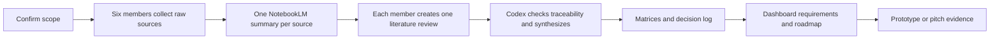

# Heat Risk Dashboard Research Workflow

## Agreed project boundary

The team is proposing a Roadmap Initiative centered on one must-have component:

> `Heat Risk Dashboard` — an IT-enabled operational view that helps users interpret heat-risk information, identify priority context, and coordinate the next contact or handoff.

The project is primarily an IT management and implementation concept applied to healthcare and public health. It is not a weather-prediction system, clinical decision-support system, diagnosis tool, or complete response platform.

## Main component and supporting content

### Main component: Heat Risk Dashboard

The dashboard should show, at minimum:

- current and forecast heat-risk status
- location or area affected
- data timestamp and source
- vulnerable-population context at an appropriate aggregate or mock-data level
- priority status or action indicator
- ownership, contact point, or handoff status

The prototype can use mock data. Any threshold or prioritization rule must be labelled as illustrative unless supported by an authoritative source and confirmed by the team.

### Five supporting components

The remaining components are content extensions, not detailed workflows:

1. Vulnerable Population Registry: what population context may be referenced and who owns it.
2. Action Workflow: what task or handoff may be triggered after a dashboard signal.
3. Communication Center: who sends which message through which channel.
4. Health Facility Preparedness: which facility contact point receives a preparedness notice.
5. Post-Event Review: who receives the summary and what feedback returns to the initiative.

For each, the team will describe only stakeholder, contact point, information passed, channel, owner, acknowledgement, and fallback. Detailed process design is out of scope for this course phase.

## End-to-end research workflow

## Phase 1: collect raw material

Each member works only in their assigned folder under `00_raw_materials/`.

For every source:

1. Save the original file or a stable source record without changing its meaning.
2. Record title, author or organization, publication date, URL or identifier, access date, and why it is relevant.
3. Avoid real patient-identifiable or confidential data.
4. Mark whether the source is evidence, a policy or standard, a comparable system, a dataset, or a team note.

## Phase 2: summarize one source at a time

Upload one member's collected sources to NotebookLM or another available AI agent. For every source, create one Markdown file in the member's analysis area using the shared prompt and the member-specific prompt in `02_analyzed_data_notebooklm/notebooklm_prompt_playbook.md`.

The filename should preserve traceability, for example:

`My_source_01_heat_index_summary.md`

Each source summary must contain:

- source metadata
- research question addressed
- key findings
- evidence and exact location in the source
- implications for the Heat Risk Dashboard
- limitations or uncertainty
- fields, requirements, or decisions suggested
- open questions

AI output is a research aid. The source remains the authority; unsupported claims must be labelled as assumptions or excluded.

## Phase 3: compile one literature review per member

After all individual source summaries are complete, each member combines them into one file:

- `Mod_literature_review.md`
- `My_literature_review.md`
- `Belle_literature_review.md`
- `Chris_literature_review.md`
- `Com_literature_review.md`
- `June_literature_review.md`

The literature review is not a paste of summaries. It should compare sources, identify agreement and disagreement, state the strongest evidence, identify gaps, and end with implications for the project.

## Phase 4: synthesize into matrices

Once the six literature reviews are available, Codex will consolidate them into:

- `feature_feasibility_impact_matrix.md`
- `data_requirement_matrix.md`
- `stakeholder_contact_point_matrix.md`
- `risk_governance_matrix.md`
- `roadmap_decision_log.md`

Every matrix row must link back to a member literature review and, where possible, the original source. Do not promote an AI-generated statement into a requirement without traceability.

## Phase 5: produce the initiative roadmap

The final research output should answer:

- What problem does the Heat Risk Dashboard address?
- Who uses it and what decision does it support?
- What is the minimum data needed?
- What is the minimum viable screen or dashboard view?
- What are the five supporting contact points and handoffs?
- What must be tested in Phase 0?
- What is explicitly deferred to a later phase?

## Three-pitch alignment

### Pitch 1: define the initiative

Problem gap, target users, one main component, six research streams, and the five supporting contact points.

### Pitch 2: show evidence and design logic

Literature-review findings, matrices, data flow, dashboard information hierarchy, assumptions, and governance risks.

### Pitch 3: show the roadmap outcome

Dashboard prototype or wireframe, mock scenario, contact-point extensions, evaluation measures, and Phase 0 implementation roadmap.

## Completion rule

The research phase is complete when every member has submitted source records, one Markdown summary per source, one literature review, and the team has enough traceable evidence to populate the matrices. The project is ready for prototype production only after the team confirms the must-have dashboard fields and the boundaries of the five supporting components.
