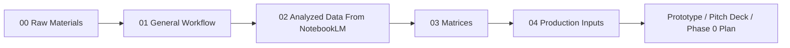

# Project Workflow

This repository is organized as a pipeline from rough project materials to prototype-ready inputs.

## Working Process

### 1. Collect Raw Materials

Put all original sources in `00_raw_materials/`.

This includes meeting notes, assignment instructions, lecture material, papers, reports, links, screenshots, or raw idea dumps.

### 2. Draft The General Workflow

Use `01_general_workflow/` to describe what the project is trying to improve.

Recommended files:

- `current_state_workflow.md`
- `future_state_workflow.md`
- `stakeholder_journey.md`
- `data_flow.md`
- `human_review_flow.md`

### 3. Digest Sources With NotebookLM

After uploading raw sources to NotebookLM, save the useful summaries in `02_analyzed_data_notebooklm/`.

Recommended files:

- `source_summary.md`
- `key_evidence.md`
- `important_quotes.md`
- `open_questions.md`

### 4. Convert Analysis Into Matrices

Use `03_matrices/` to turn research into decisions.

Recommended matrices:

- topic selection matrix
- feasibility-impact matrix
- stakeholder matrix
- prototype feature matrix
- data requirement matrix
- risk and governance matrix

### 5. Prepare Production Inputs

Only move information into `04_production_inputs/` when it is ready to be used in the prototype or pitch.

Recommended files:

- `mock_cases.csv`
- `decision_rules.md`
- `prototype_requirements.md`
- `demo_scenarios.md`
- `final_references.md`

## Codex Working Rule

Codex should mainly use `02_analyzed_data_notebooklm/`, `03_matrices/`, and `04_production_inputs/` when building prototype data, pitch materials, diagrams, or implementation plans.

Raw materials should be used for traceability and verification, not as the first source for production output.
